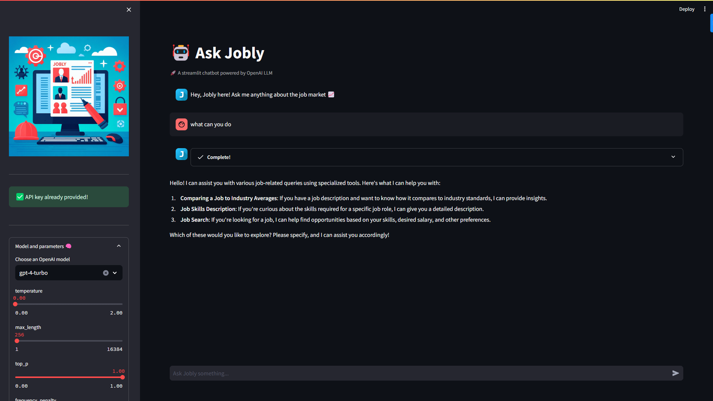

# job-market-analysis

CS-GY 6513 - Big Data - Final Project

We aim to answer 3 questions for users -

- How does this job posting compare to other similar jobs?
- What skills does this job role usually require?
- Based on my profile, what sort of job role fits me best?

Various technologies used in this project include -

- Python
- Spark
- Spark NLP
- YAKE
- Oxylabs API
- Flask
- OpenAI API
- LangChain

To view more details, refer to the `README` under each section (`data-analysis`, `data-scraping`, `web-app`, `outputs`).

---

# Authors

**Matthew So** - BigData 
**Rohit Mohanty** - BigData 
**Shashank datta Bezgam** - Full Stack & LangChain 
**Ke Zhang** - Full Stack & LangChain 
**Jasmine Wu** - Jobs Data Web Crawler 

---

[Get an OpenAI API key](https://platform.openai.com/account/api-keys)

